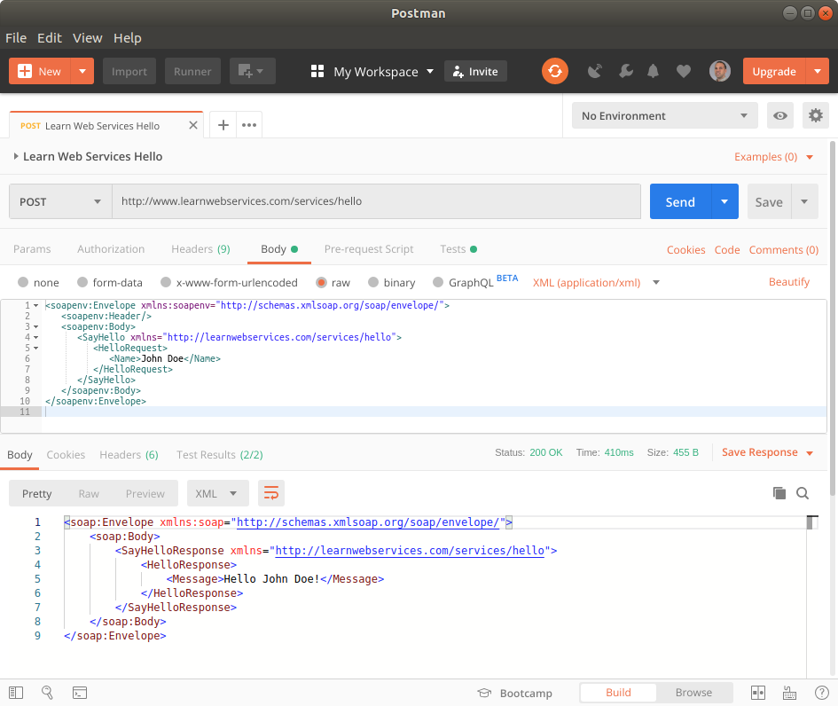
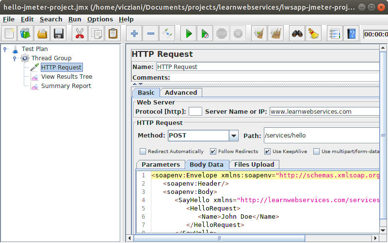

<div class="pt-3 text-right">
  Last update:
  <span class="text-nowrap font-weight-bold">June 12, 2022</span>
</div>
<div class="pt-3 text-right">
  <a href="https://github.com/vicziani/learnwebservices/blob/master/CHANGELOG.md">
    Version
    <span class="text-nowrap font-weight-bold">2.0.0</span>
    </a>
</div>

# Introduction

<hr />

## TL;DR

If you want a simple, online web service, here is a WSDL for it:

<div class="form-row d-flex justify-content-center mb-3">
  <div class="input-group col-md-8">
    <input type="text" value="{{site.api_url}}/services/hello?WSDL" id="highlighted-wsdl-hello" class="form-control"/>
    <div class="input-group-append">
      <button class="btn btn-outline-primary btn-copy" type="button" data-clipboard-target="#highlighted-wsdl-hello" title="Copied">
        <i class="copy-button far fa-copy"></i>
        </button>
    </div>  
    <div>
      <span id="health-check-badge" class="badge d-none ml-2">Unknown</span>
    </div>
  </div>
</div>

Firefox browser does not show us the WSDL document, just a blank page, so it is better to use the _View Page Source_ menu to view the document. The WSDL document is [available here](wsdl.html) in readable format. 

<div class="alert alert-danger" role="alert">
    <h3 class="alert-heading">Warning!</h3>

    In version 2.0.0 the URL has changed from <code class="highlighter-rouge">http://www.learnwebservices.com/services/hello?WSDL</code> to 
    <code class="highlighter-rouge">https://apps.learnwebservices.com/services/hello?WSDL</code>.
    The WSDL and the SOAP structure has simplified, so the clients must be modified or regenerated.
</div>

## Purpose of this site

Creating this site has two purposes. One is to provide some free, public, SOAP web services examples for learning, prototyping, teaching, testing, demonstrating tools, libraries or technologies. You may use these web services in blog posts, tutorials, videos. I would like to operate this website for reference in the long run.

The second purpose is to present client applications examples in different programming languages, using with different libraries. You can find the source code of the examples on GitHub what I am going to  update regularly for  the latest versions.


## About SOAP web services

SOAP web services may be considered as best practices to exchange data between different applications, based on XML and mostly HTTP(S) protocol. Because of the formats and protocols are text based, they are readable by most of the applications and by humans as well. Web services became very popular, and easy to use on any platform and with any programming language.

SOAP web services are based on OASIS and W3C standards, and the  WS-I organization provides some useful profiles to increase interoperability.

SOAP is a messaging protocol specifying an XML-based message format. This is called the SOAP envelope, encapsulating the message content. The WSDL format is based on XML as well, and specifies the interface - how to call the service, and what are the input and output formats.

Sometime the SOAP web services are considered legacy solutions today, because the RESTful web services are becoming increasingly popular. Also  this is true, but the SOAP web services will be along for a long time.

# Details

<hr />

The web service accepts a name, and gives back a welcome message. (The service accepts only POST HTTP requests so you may not use it in a browser directly.)

The WSDL specifies the format of the request message. The content of the `Name` tag may be freely rewritten.

```xml
<soapenv:Envelope xmlns:soapenv="http://schemas.xmlsoap.org/soap/envelope/">
   <soapenv:Header/>
   <soapenv:Body>
       <HelloRequest xmlns="http://learnwebservices.com/services/hello">
          <Name>John Doe</Name>
       </HelloRequest>
   </soapenv:Body>
</soapenv:Envelope>
```

This is the response provided by the web service. The `Message` tag contains the
response message based on the request.

```xml
<soap:Envelope xmlns:soap="http://schemas.xmlsoap.org/soap/envelope/">
   <soap:Body>
       <HelloResponse xmlns="http://learnwebservices.com/services/hello">
          <Message>Hello John Doe!</Message>
       </HelloResponse>
   </soap:Body>
</soap:Envelope>
```

### Error handling

In case a web service fails to process the SOAP message, it returns a SOAP fault.

```xml
<soap:Envelope xmlns:soap="http://schemas.xmlsoap.org/soap/envelope/">
   <soap:Body>
      <soap:Fault>
         <faultcode>soap:Client</faultcode>
         <faultstring>Unmarshalling Error: Unexpected '&lt;' character in element (missing closing '>'?)
 at [row,col {unknown-source}]: [6,13]</faultstring>
      </soap:Fault>
   </soap:Body>
</soap:Envelope>
```

# Other services

<hr />

Celsius to Fahrenheit converter

<div class="d-flex justify-content-center mb-3">
  <div class="form-row col-md-8">
    <div class="input-group">    
      <input type="text" value="{{site.api_url}}/services/tempconverter?wsdl" id="highlighted-wsdl-temp" class="form-control"/>
      <div class="input-group-append">
        <button class="btn btn-outline-primary btn-copy" type="button" data-clipboard-target="#highlighted-wsdl-temp" title="Copied">
          <i class="copy-button far fa-copy"></i>
          </button>
      </div>
      <div>
        <span id="health-check-badge-converter" class="badge d-none ml-2">Unknown</span>
      </div>
    </div>
  </div>
</div>

# Server application

<hr />

A Spring Boot server application serves the sample web services.

<p><a class="github-icon" href="https://github.com/vicziani/learnwebservices-server/" title="Source code on GitHub"><i class="fab fa-github"></i></a>
<a href="https://github.com/vicziani/learnwebservices-server/">Source code</a></p>

The application is available on [Docker Hub](https://hub.docker.com/r/vicziani/lwsapp).

If you would like to run with Docker, just use the following command.

```shell
docker run -p 8080:8080 --name my-lwsapp vicziani/lwsapp
```

Then check the `http://localhost:8080` address!

# Client implementations

<hr />

<ul class="nav nav-pills" id="implementationsTab" role="tablist">
  <li class="nav-item">
    <a class="nav-link active" id="soapui-tab" data-toggle="tab" href="#soapui" role="tab" aria-controls="home" aria-selected="true">SoapUI</a>
  </li>
  <li class="nav-item">
    <a class="nav-link" id="postman-tab" data-toggle="tab" href="#postman" role="tab" aria-controls="contact" aria-selected="false">Postman</a>
  </li>
  <li class="nav-item">
    <a class="nav-link" id="jmeter-tab" data-toggle="tab" href="#jmeter" role="tab" aria-controls="contact" aria-selected="false">JMeter</a>
  </li>
  <li class="nav-item">
    <a class="nav-link" id="curl-tab" data-toggle="tab" href="#curl" role="tab" aria-controls="profile" aria-selected="false">CURL</a>
  </li>
  <li class="nav-item">
    <a class="nav-link" id="wget-tab" data-toggle="tab" href="#wget" role="tab" aria-controls="contact" aria-selected="false">Wget</a>
  </li>
  <li class="nav-item">
    <a class="nav-link" id="httpie-tab" data-toggle="tab" href="#httpie" role="tab" aria-controls="contact" aria-selected="false">HTTPie</a>
  </li>
  <li class="nav-item">
    <a class="nav-link" id="jaxws-tab" data-toggle="tab" href="#jaxws" role="tab" aria-controls="contact" aria-selected="false">Java JAX-WS RI/CXF</a>
  </li>
  <li class="nav-item">
    <a class="nav-link" id="sws-tab" data-toggle="tab" href="#sws" role="tab" aria-controls="contact" aria-selected="false">Java Spring Web Services</a>
  </li>
  <li class="nav-item">
    <a class="nav-link" id="axis2-tab" data-toggle="tab" href="#axis2" role="tab" aria-controls="contact" aria-selected="false">Java Apache Axis2</a>
  </li>
  <li class="nav-item">
    <a class="nav-link" id="groovy-tab" data-toggle="tab" href="#groovy" role="tab" aria-controls="contact" aria-selected="false">Groovy</a>
  </li>
  <li class="nav-item">
    <a class="nav-link" id="python-tab" data-toggle="tab" href="#python" role="tab" aria-controls="contact" aria-selected="false">Python</a>
  </li>
  <li class="nav-item">
    <a class="nav-link" id="js-tab" data-toggle="tab" href="#js" role="tab" aria-controls="contact" aria-selected="false">JavaScript</a>
  </li>
  <li class="nav-item">
    <a class="nav-link" id="nodejs-tab" data-toggle="tab" href="#nodejs" role="tab" aria-controls="contact" aria-selected="false">Node.js</a>
  </li>
  <li class="nav-item">
    <a class="nav-link" id="dotnet-tab" data-toggle="tab" href="#dotnet" role="tab" aria-controls="contact" aria-selected="false">.NET Core C#</a>
  </li>
  <li class="nav-item">
    <a class="nav-link" id="ruby-tab" data-toggle="tab" href="#ruby" role="tab" aria-controls="contact" aria-selected="false">Ruby</a>
  </li>
  <li class="nav-item">
    <a class="nav-link" id="php-tab" data-toggle="tab" href="#php" role="tab" aria-controls="contact" aria-selected="false">PHP</a>
  </li>
</ul>

<div class="tab-content" id="myTabContent">

<div class="tab-pane fade show active" id="soapui" role="tabpanel" aria-labelledby="soapui-tab" markdown="1">

To [call the web service with SoapUI](https://www.soapui.org/soap-and-wsdl/getting-started.html), create a new SOAP project in the application,
and paste the URL of the WSDL document [{{site.api_url}}/services/hello?WSDL]({{site.api_url}}/services/hello?WSDL) into the _Initial WSDL_
input field.
SoapUI will process the WSDL file, and generate an example request. On the left side of the panel choose the `SayHello` operation, then the
`Request 1` example request. Give a name value in the `Name` tag (replacing the `?` sign), then press the _Submit request_ button.

Click on the picture to view the full animation that shows how to create a request with SoapUI!

<div class="demo-image">
  <a href="images/soapui-anim.gif" data-lightbox="learnwebservices">
    
  </a>
</div>

<p><a class="github-icon" href="https://github.com/vicziani/learnwebservices/tree/master/lwsapp-soapui-project" title="Project on GitHub"><i class="fab fa-github"></i></a>
<a href="https://github.com/vicziani/learnwebservices/tree/master/lwsapp-soapui-project">SoapUI project file</a></p>

</div>
<div class="tab-pane fade" id="postman" role="tabpanel" aria-labelledby="postman-tab" markdown="1">

Click on the picture to view the full animation that shows how to create a Postman project!

<div class="demo-image">
  <a href="images/postman-anim.gif" data-lightbox="learnwebservices">
    
  </a>
</div>

<p><a class="github-icon" href="https://github.com/vicziani/learnwebservices/tree/master/lwsapp-postman-collection" title="Collection file on GitHub"><i class="fab fa-github"></i></a>
<a href="https://github.com/vicziani/learnwebservices/tree/master/lwsapp-postman-collection">Postman Collection file</a></p>

</div>
<div class="tab-pane fade" id="jmeter" role="tabpanel" aria-labelledby="jmeter-tab" markdown="1">

Apache JMeter may be used to test performance of SOAP web services.

Click on the picture to view the full animation that shows how to create a JMeter project.

<div class="demo-image">
  <a href="images/jmeter-anim.gif" data-lightbox="learnwebservices">
    
  </a>
</div>

<p><a class="github-icon" href="https://github.com/vicziani/learnwebservices/tree/master/lwsapp-jmeter-project" title="Project on GitHub"><i class="fab fa-github"></i></a>
<a href="https://github.com/vicziani/learnwebservices/tree/master/lwsapp-jmeter-project">JMeter project file</a></p>

</div>
<div class="tab-pane fade" id="curl" role="tabpanel" aria-labelledby="curl-tab" markdown="1">

<!-- Tip: try this site with the `curl https://www.learnwebservices.com` command. -->

Use the following command to call the web service with curl.

```
curl --request POST --header "Content-Type: text/xml;charset=UTF-8"  \
  --data '<soapenv:Envelope xmlns:soapenv="http://schemas.xmlsoap.org/soap/envelope/"><soapenv:Header/> \
  <soapenv:Body> \
  <HelloRequest xmlns="http://learnwebservices.com/services/hello"><Name>John Doe</Name></HelloRequest> \
  </soapenv:Body></soapenv:Envelope>' \
  https://apps.learnwebservices.com/services/hello
```

</div>
<div class="tab-pane fade" id="wget" role="tabpanel" aria-labelledby="wget-tab" markdown="1">

Use the following command to call the web service with Wget.

```
wget -qO - --header "Content-Type: text/xml;charset=UTF-8"  \
  --post-data '<soapenv:Envelope xmlns:soapenv="http://schemas.xmlsoap.org/soap/envelope/"><soapenv:Header/> \
  <soapenv:Body> \
  <HelloRequest xmlns="http://learnwebservices.com/services/hello"><Name>John Doe</Name></HelloRequest> \
  </soapenv:Body></soapenv:Envelope>' \
  https://apps.learnwebservices.com/services/hello
```

</div>
<div class="tab-pane fade" id="httpie" role="tabpanel" aria-labelledby="httpie-tab" markdown="1">

Use the following command to call the web service with [HTTPie](https://httpie.org/).

```
echo '<soapenv:Envelope xmlns:soapenv="http://schemas.xmlsoap.org/soap/envelope/"><soapenv:Header/> \
  <soapenv:Body> \
  <HelloRequest xmlns="http://learnwebservices.com/services/hello"><Name>John Doe</Name></HelloRequest> \
  </soapenv:Body></soapenv:Envelope>' | \
  http -b POST https://apps.learnwebservices.com/services/hello  'Content-Type:text/xml;charset=UTF-8'
```

</div>
<div class="tab-pane fade" id="jaxws" role="tabpanel" aria-labelledby="jaxws-tab" markdown="1">

The following source code demonstrates calling the web service using
[JAX-WS RI](https://javaee.github.io/metro-jax-ws/) library and
[jaxws-maven-plugin](https://www.mojohaus.org/jaxws-maven-plugin/) Maven plugin.

The source code is the same when using [CXF](http://cxf.apache.org)
with [cxf-codegen-plugin](http://cxf.apache.org/docs/maven-cxf-codegen-plugin-wsdl-to-java.html)
Maven plugin.

```java
HelloEndpointService service = new HelloEndpointService();
HelloEndpoint port = service.getHelloEndpointPort();
HelloRequest request = new HelloRequest();
request.setName("John Doe");
HelloResponse response = port.sayHello(request);
System.out.println(response.getMessage());
```

<p><a class="github-icon" href="https://github.com/vicziani/learnwebservices/tree/master/lwsapp-jaxwsri-client" title="JAX-WS source code on GitHub"><i class="fab fa-github"></i></a>
<a href="https://github.com/vicziani/learnwebservices/tree/master/lwsapp-jaxwsri-client">Source code with JAX-WS RI</a></p>

<p><a class="github-icon" href="https://github.com/vicziani/learnwebservices/tree/master/lwsapp-cxf-client" title="Source code on GitHub"><i class="fab fa-github"></i></a>
<a href="https://github.com/vicziani/learnwebservices/tree/master/lwsapp-cxf-client">Source code with CXF</a></p>

</div>
<div class="tab-pane fade" id="sws" role="tabpanel" aria-labelledby="sws-tab" markdown="1">


The following source code demonstrates calling the web service using
[Spring Web Services](https://spring.io/projects/spring-ws) library and
[maven-jaxb2-plugin](https://github.com/highsource/maven-jaxb2-plugin) Maven plugin.

```java
HelloRequest helloRequest = new HelloRequest();
helloRequest.setName("John Doe");

JAXBElement<HelloResponse> response = (JAXBElement<HelloResponse>)
        webServiceTemplate.marshalSendAndReceive(new ObjectFactory().createHelloRequest(helloRequest));

System.out.println(response.getValue().getMessage());
```

<p><a class="github-icon" href="https://github.com/vicziani/learnwebservices/tree/master/lwsapp-springws-client" title="Source code on GitHub"><i class="fab fa-github"></i></a>
<a href="https://github.com/vicziani/learnwebservices/tree/master/lwsapp-springws-client">Source code</a></p>

</div>
<div class="tab-pane fade" id="axis2" role="tabpanel" aria-labelledby="axis2-tab" markdown="1">


The following source code demonstrates calling the web service using
[Apache Axis2/Java](http://axis.apache.org/axis2/java/core/index.html) library,
Axis2 Databinding Framework and
[axis2-wsdl2code-maven-plugin](https://axis.apache.org/axis2/java/core/tools/maven-plugins/axis2-wsdl2code-maven-plugin/index.html) Maven plugin.

```java
HelloEndpointServiceStub stub =
        new HelloEndpointServiceStub();

HelloEndpointServiceStub.HelloRequest helloRequest =
        new HelloEndpointServiceStub.HelloRequest();
helloRequest.setName("John Doe");

HelloEndpointServiceStub.HelloRequestE sayHelloE =
        new HelloEndpointServiceStub.HelloRequestE();
sayHelloE.setHelloRequest(helloRequest);

HelloEndpointServiceStub.HelloResponseE sayHelloResponseE =
        stub.sayHello(sayHelloE);
System.out.println(sayHelloResponseE
        .getHelloResponse()
        .getMessage());
```

<p><a class="github-icon" href="https://github.com/vicziani/learnwebservices/tree/master/lwsapp-axis2-client" title="Source code on GitHub"><i class="fab fa-github"></i></a>
<a href="https://github.com/vicziani/learnwebservices/tree/master/lwsapp-axis2-client">Source code</a></p>

</div>
<div class="tab-pane fade" id="groovy" role="tabpanel" aria-labelledby="groovy-tab" markdown="1">

The following source code demonstrates calling the web service using
[groovy-wslite](https://github.com/jwagenleitner/groovy-wslite) library.

```groovy
@Grab('com.github.groovy-wslite:groovy-wslite:1.1.2')
import wslite.soap.*

def client = new SOAPClient('https://apps.learnwebservices.com/services/hello')
def response = client.send {
    body {
        HelloRequest('xmlns':'http://learnwebservices.com/services/hello') {
          Name("John Doe")
        }
    }
}

println(response.HelloResponse.Message)
```

<p><a class="github-icon" href="https://github.com/vicziani/learnwebservices/tree/master/lwsapp-groovy-client" title="Source code on GitHub"><i class="fab fa-github"></i></a>
<a href="https://github.com/vicziani/learnwebservices/tree/master/lwsapp-groovy-client">Source code</a></p>


</div>
<div class="tab-pane fade" id="python" role="tabpanel" aria-labelledby="python-tab" markdown="1">

The following source code uses the [Zeep](https://github.com/mvantellingen/python-zeep) framework to call the web service.

```python
wsdl = 'https://apps.learnwebservices.com/services/hello?wsdl'
client = zeep.Client(wsdl=wsdl)
request = 'John Doe'
print(client.service.SayHello(request))
```

<p><a class="github-icon" href="https://github.com/vicziani/learnwebservices/tree/master/lwsapp-python-client" title="Source code on GitHub"><i class="fab fa-github"></i></a>
<a href="https://github.com/vicziani/learnwebservices/tree/master/lwsapp-python-client">Source code</a></p>

</div>
<div class="tab-pane fade" id="js" role="tabpanel" aria-labelledby="js-tab" markdown="1">

It is possible to call a web service from JavaScript running in the browser when it is in the same domain, or the
Cross-Origin Resource Sharing (CORS) is properly configured.

```javascript
const url = "https://apps.learnwebservices.com/services/hello";
const request = `<soapenv:Envelope xmlns:soapenv="http://schemas.xmlsoap.org/soap/envelope/">
    <soapenv:Header/>
    <soapenv:Body>
        <HelloRequest xmlns="http://learnwebservices.com/services/hello">
            <Name>John Doe</Name>
        </HelloRequest>
    </soapenv:Body>
 </soapenv:Envelope>`;

 const fetchData = {
    method: 'POST',
    body: request
 };

 fetch(url, fetchData)
   .then(function(response) {
     return response.text();
   })
   .then(function(xml) {
       const xmlDoc = new DOMParser().parseFromString(xml, "text/xml");
       console.log(xmlDoc.getElementsByTagNameNS("http://learnwebservices.com/services/hello", "Message")[0].textContent);
   })
   .catch(function(error) {
     console.log("Error calling webservice: " + error);
   });
```

You can try this online by pressing the _Call the web service!_ button below.

<div id="webservice-error-div" class="alert alert-danger d-none" role="alert">
  A web service is not available!
</div>
<form id="hello-form">
 <div class="form-row">
    <div class="col-sm mb-3">
      <input id="hello-name-input" type="text" placeholder="Your name" class="form-control" />
    </div>
    <div class="col-sm mb-3">
      <input id="hello-message-input" type="text" readonly="readonly" class="form-control" />
    </div>    
    <div class="col-sm mb-3">
    <button type="submit" class="btn btn-primary text-nowrap">Call the web service!</button>
  </div>    
</div>
</form>

<p><a class="github-icon" href="https://github.com/vicziani/learnwebservices/tree/master/lwsapp-vanillajs-client" title="Source code on GitHub"><i class="fab fa-github"></i></a>
<a href="https://github.com/vicziani/learnwebservices/tree/master/lwsapp-vanillajs-client">Source code</a></p>

</div>
<div class="tab-pane fade" id="nodejs" role="tabpanel" aria-labelledby="nodejs-tab" markdown="1">

The following source code demonstrates how to call a web service with Node.js and [SOAP](https://github.com/vpulim/node-soap#readme) package.

```javascript
const soap = require("soap");
const url = "https://apps.learnwebservices.com/services/hello?wsdl";
const args = {Name: "John Doe"};
soap.createClient(url, function(err, client) {
    client.SayHello(args, function(err, result) {
        console.log(result.Message);
    });
});
```

<p><a class="github-icon" href="https://github.com/vicziani/learnwebservices/tree/master/lwsapp-js-client" title="Source code on GitHub"><i class="fab fa-github"></i></a>
<a href="https://github.com/vicziani/learnwebservices/tree/master/lwsapp-js-client">Source code</a></p>

</div>
<div class="tab-pane fade" id="dotnet" role="tabpanel" aria-labelledby="dotnet-tab" markdown="1">

The following source code demonstrates how to call a web service with .NET Core using C# language.

```csharp
HelloEndpointClient proxy = new HelloEndpointClient();
var request = new helloRequest
{
    Name = "John Doe"
};
var response = await proxy.SayHelloAsync(request);
Console.WriteLine(response.Body.HelloResponse.Message);
```

<p><a class="github-icon" href="https://github.com/vicziani/learnwebservices/tree/master/SoapClient" title="Source code on GitHub"><i class="fab fa-github"></i></a>
<a href="https://github.com/vicziani/learnwebservices/tree/master/SoapClient">Source code</a></p>

</div>
<div class="tab-pane fade" id="ruby" role="tabpanel" aria-labelledby="ruby-tab" markdown="1">

The following source code demonstrates how to call a web service with Ruby and
[Savon](https://github.com/savonrb/savon).

```ruby
require 'savon'

client = Savon.client(wsdl: 'https://apps.learnwebservices.com/services/hello?WSDL')
response = client.call(
  :say_hello,
  soap_action: '',
  message: { 'Name' => 'John Doe' }
)
puts response.body[:hello_response][:message]
```

<p><a class="github-icon" href="https://github.com/vicziani/learnwebservices/tree/master/lwsapp-ruby-client" title="Source code on GitHub"><i class="fab fa-github"></i></a>
<a href="https://github.com/vicziani/learnwebservices/tree/master/lwsapp-ruby-client">Source code</a></p>

</div>
<div class="tab-pane fade" id="php" role="tabpanel" aria-labelledby="php-tab" markdown="1">

The following source code demonstrates how to call a web service with PHP and [SOAP extension](https://www.php.net/manual/en/book.soap.php).

```php
<?php

$client = new SoapClient('https://apps.learnwebservices.com/services/hello?wsdl');
echo $client
	->SayHello(
		[
				'Name' => 'John Doe'
		]
	)
	->Message
;
```

<p><a class="github-icon" href="https://github.com/vicziani/learnwebservices/tree/master/lwsapp-php-client" title="Source code on GitHub"><i class="fab fa-github"></i></a>
<a href="https://github.com/vicziani/learnwebservices/tree/master/lwsapp-php-client">Source code</a></p>

</div>
</div>

## Contributors

* Rita Kuti
* Mauro Chojrin ([mchojrin](https://github.com/mchojrin))
* János Rácz ([rczjns](https://github.com/rczjns))
* Bea Vörös ([beavoros](https://github.com/beavoros))
