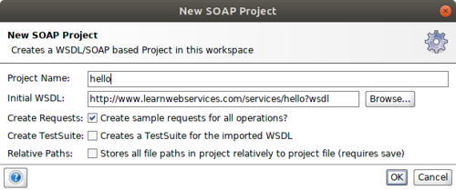
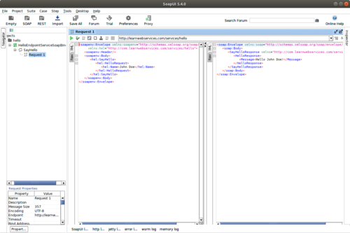

# Bevezetés

## TL;DR

Ha szükséged van gyorsan kipróbálni valamit, itt egy WSDL, és mögötte egy működő SOAP
webszolgáltatás:

  <a id="highlighted-wsdl-hello" href="http://www.learnwebservices.com/services/hello?WSDL">http://www.learnwebservices.com/services/hello?WSDL</a>  
  <i class="copy-button far fa-copy" data-clipboard-target="#highlighted-wsdl-hello"></i>  

## Az oldal célja

Ez az oldal azért jött létre, hogy ingyenes, publikus példa SOAP
webszolgáltatásokat biztosítson tanuláshoz, oktatáshoz,
kísérletezéshez. Az itt található webszolgáltatások kitűnőek a
technológia bemutatásához és megismeréséhez, különböző eszközök és
keretrendszerek teszteléséhez. Ezen webszolgáltatásokat lehet használni
dokumentációkban, példákban, tutoriálokban, videókban, hisz célom, hogy
hosszú távon megmaradjanak.
Az oldalon ezen kívül megtalálhatóak
különböző programozási nyelven implementált kliens programok
(forráskóddal együtt), melyek jó kiindulási alapot biztosíthatnak a
technológia használatba vételéhez. Gyakran frissítem ezeket, ahogy kijönnek
a nyelvek és keretrendszerek új verziói.

## Webszolgáltatásokról

A SOAP webszolgáltatások alkalmazások közötti adatcserére valók. XML és
főleg HTTP(S) technológiákra támaszkodnak. Ezért ember és számítógép
által is könnyen értelmezhetőek, valamint a legtöbb platformon
használhatóak, ezért különösen alkalmasak különböző platformon és
programozási nyelven fejlesztett alkalmazások együttműködésére. A SOAP
webszolgáltatások az OASIS és W3C szabványügyi szervezetek által
karbantartott szabányokon nyugszanak. WS-I szervezet több profilt
fejlesztett ki a különböző implementációk együttműködésének segítségére.
A SOAP egy XML alapú üzenetformátum, mely egy SOAP borítékot definiál,
melyben az üzenetek utaznak. A WSDL szintén egy XML alapú interfészleíró
nyelv. A SOAP webszolgáltatásokat a modernebb, egyszerűbben használható
RESTful webszolgáltatások kezdik kiszorítani. Azonban még történeti
jelleggel sok helyen találhatóak SOAP webszolgáltatások, melyekhez
modern programokból is csatlakozni kell.

# Példák

## További webszolgáltatások

<table class="table table-borderless table-striped">
  <!--<thead>
    <tr>
      <th>Funkció</th>
      <th>WSDL</th>
    </tr>
  </thead>-->
  <tbody>
    <tr>
      <td>Celsius és Fahrenheit váltás</td>
      <td>
        
        <a id="highlighted-wsdl-temp" href="http://www.learnwebservices.com/services/tempconverter?wsdl">http://www.learnwebservices.com/services/tempconverter?wsdl</a>  
        <i class="copy-button far fa-copy" data-clipboard-target="#highlighted-wsdl-temp"></i>  
        
      </td>
    </tr>
</tbody>
</table>

## Egy példa webszolgáltatás

Egy SOAP webszolgáltatás található `http://www.learnwebservices.com/services/hello`
címen, mely egy nevet vár, és egy üdvözlőszöveget ad vissza.

A SOAP webszolgáltatás WSDL dokumentuma elérhető a [http://www.learnwebservices.com/services/hello?WSDL](http://www.learnwebservices.com/services/hello?WSDL) címen.
(A WSDL dokumentum egy XML dokumentum, melyet a Firefox nem jelenít meg, csak a _View Page Source_ menüpontra kattintva.)

A címre a következő formátumban kell posztolni egy XML dokumentumot (a WSDL-ben leírtaknak megfelelően).
A `Name` tag értéke tetszőlegesen módosítható.


<soapenv:Envelope xmlns:soapenv="http://schemas.xmlsoap.org/soap/envelope/">
   <soapenv:Header/>
   <soapenv:Body>
      <SayHello xmlns="http://learnwebservices.com/services/hello">
         <HelloRequest>
            <Name>John Doe</Name>
         </HelloRequest>
      </SayHello>
   </soapenv:Body>
</soapenv:Envelope>


Ennek hatására a SOAP webszolgáltatás a következő válaszüzenetet adja vissza.
A név alapján változó üzenetet a `Message` tag tartalmazza.


<soap:Envelope xmlns:soap="http://schemas.xmlsoap.org/soap/envelope/">
   <soap:Body>
      <SayHelloResponse xmlns="http://learnwebservices.com/services/hello">
         <HelloResponse>
            <Message>Hello John Doe!</Message>
         </HelloResponse>
      </SayHelloResponse>
   </soap:Body>
</soap:Envelope>


## Hívása SoapUI használatával

SoapUI használatával a [hivatalos dokumentáció](https://www.soapui.org/soap-and-wsdl/getting-started.html) alapján létre
kell hozni egy új SOAP projektet, és a _Initial WSDL_ beviteli mezőben megadni a [http://www.learnwebservices.com/services/hello?WSDL](http://www.learnwebservices.com/services/hello?WSDL)
címet, majd kiválasztani bal oldalon a `SayHello` operációt, és megnyitni a `Request 1` példa kérést. A nevet
megadni a `Name` tagen belül lehet. Majd meg kell nyomni a zöld _Submit request_ gombot.

  

  

<a class="github-icon" href="https://github.com/vicziani/learnwebservices/tree/master/lwsapp-soapui-project" title="Forráskód a GitHubon"><i class="fab fa-github"></i></a>
Egy példa SoapUI projekt elérhető a GitHubon.

## Hívása Javaban

A SOAP webszolgáltatás Javaban is hívható, valamelyik webszolgáltatás keretrendszer felhasználásával.
Ebből az egyik a [JAX-WS RI](https://javaee.github.io/metro-jax-ws/).

Ennek használatával a következőképp hívható a SOAP webszolgáltatás:


URL url = new URL("http://www.learnwebservices.com/services/hello?wsdl");
HelloEndpointService service = new HelloEndpointService(url);
HelloEndpoint port = service.getHelloEndpointPort();
HelloRequest request = new HelloRequest();
request.setName("John Doe");
HelloResponse response = port.sayHello(request);
System.out.println(response.getMessage());


<a class="github-icon" href="https://github.com/vicziani/learnwebservices/tree/master/lwsapp-jaxwsri-client" title="Forráskód a GitHubon"><i class="fab fa-github"></i></a>
Egy példa Java kliens elérhető a GitHubon.

## Hívása Pythonban

Használható a [Zeep](https://github.com/mvantellingen/python-zeep) keretrendszer.


wsdl = 'http://www.learnwebservices.com/services/hello?wsdl'
client = zeep.Client(wsdl=wsdl)
request = {'Name': 'John Doe'}
print(client.service.SayHello(request))


<a class="github-icon" href="https://github.com/vicziani/learnwebservices/tree/master/lwsapp-python-client" title="Forráskód a GitHubon"><i class="fab fa-github"></i></a>
Egy példa Python kliens elérhető a GitHubon.

## Hívása Node.js esetén

Használható a [SOAP](https://github.com/vpulim/node-soap#readme) projekt.


var soap = require('soap');
var url = 'http://www.learnwebservices.com/services/hello?wsdl';
var args = {HelloRequest: {Name: 'John Doe'}};
soap.createClient(url, function(err, client) {
    client.SayHello(args, function(err, result) {
        console.log(result.HelloResponse.Message);
    });
});


<a class="github-icon" href="https://github.com/vicziani/learnwebservices/tree/master/lwsapp-js-client" title="Forráskód a GitHubon"><i class="fab fa-github"></i></a>
Egy példa Node.js kliens elérhető a GitHubon.

## Hívása .NET Core keretrendszerrel C# nyelven


HelloEndpointClient proxy = new HelloEndpointClient();
var request = new helloRequest
{
    Name = "John Doe"
};
var response = await proxy.SayHelloAsync(request);
Console.WriteLine(response.Body.HelloResponse.Message);


<a class="github-icon" href="https://github.com/vicziani/learnwebservices/tree/master/SoapClient" title="Forráskód a GitHubon"><i class="fab fa-github"></i></a>
Egy példa C# kliens elérhető a GitHubon.

